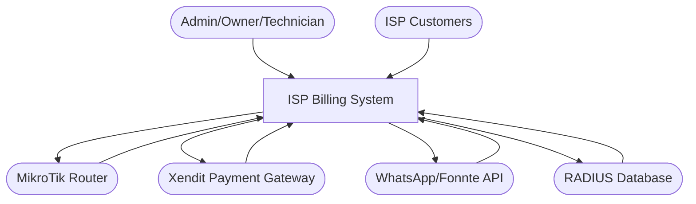
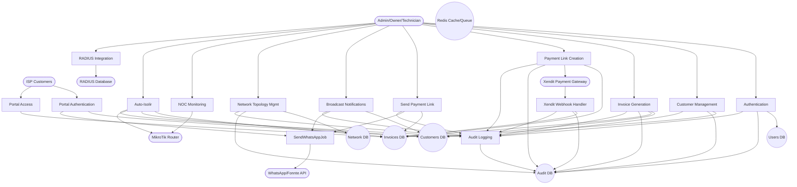

# Data Flow Diagrams (DFD) - ISP Billing System

## DFD Level 0: Context Diagram

This diagram shows the overall context of the ISP Billing System with external entities and primary data flows.

### External Entities:
- **Admin/Owner/Technician**: Administrative users managing the system
- **ISP Customers**: End users accessing the billing portal
- **MikroTik Router**: Network device for ISP infrastructure management
- **Xendit Payment Gateway**: External payment processing service
- **WhatsApp/Fonnte API**: Messaging service for notifications
- **RADIUS Database**: External database for user authentication sessions

---

## DFD Level 1: Detailed Diagram

This diagram decomposes the ISP Billing System into 15 core processes, showing internal data flows and data stores.

### Process Descriptions:
1. **Authentication**: User login with Sanctum tokens
2. **Customer Management**: CRUD operations for customer records
3. **Invoice Generation**: Batch creation of monthly invoices
4. **Payment Link Creation**: Generate Xendit payment links
5. **Send Payment Link**: Dispatch WhatsApp messages with payment links
6. **Xendit Webhook Handler**: Process payment confirmations
7. **Broadcast Notifications**: Send messages to multiple customers
8. **SendWhatsAppJob**: Queue worker for WhatsApp API calls
9. **Network Topology Mgmt**: Manage network nodes and connections
10. **NOC Monitoring**: Real-time network monitoring
11. **Auto-Isolir**: Automatic customer suspension for overdue payments
12. **Portal Authentication**: Magic link authentication for customers
13. **Portal Access**: Customer portal invoice viewing
14. **RADIUS Integration**: Query active user sessions
15. **Audit Logging**: Record all administrative actions

### Data Stores:
- **Users DB**: Administrative user accounts
- **Customers DB**: ISP subscriber information
- **Invoices DB**: Billing records and payment data
- **Network DB**: Network topology and equipment
- **Audit DB**: Activity logging
- **Redis Cache/Queue**: Caching, job queuing, broadcasting

---

## Key Data Flows

### Payment Cycle:
Admin → Invoice Generation → Payment Link Creation → Send via WhatsApp → Customer Pays → Webhook Updates Status

### Network Management:
Admin → Network Topology → NOC Monitoring → Auto-Isolir (suspends customers via MikroTik)

### Customer Portal:
Customer → Portal Authentication (magic link) → Portal Access (view invoices)

---

## Security Considerations

- **Trust Boundaries**: Frontend-Backend (Sanctum), Backend-External APIs (API keys), Backend-Databases (encryption)
- **Encryption**: Sensitive fields (phone, email, address) encrypted in database
- **Authentication**: RBAC for admins, magic links for customers
- **Audit Trail**: All admin actions logged with IP and timestamp

---

*Generated on: May 13, 2026*
*Based on codebase exploration and user stories*</content>
<parameter name="filePath">c:\Users\ramar\Downloads\billing-isp-20260402T014522Z-1-001\DFD_Diagrams.md