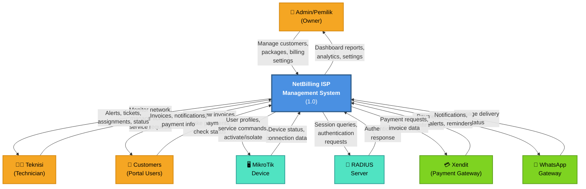

# Data Flow Diagram Level 0 (System Context Diagram)
## NetBilling ISP Management System

---

## System Context Overview

This diagram represents the entire NetBilling ISP Management System as a single process, showing all external entities (actors) that interact with it and the major data flows between them.

---

## DFD Level 0 Diagram

---

## External Entities (Data Sources & Recipients)

| Entity | Type | Description | Data Flow Direction |
|--------|------|-------------|----------------------|
| **Admin/Pemilik** | Person | System owner/administrator with full access | ↔️ Bidirectional |
| **Teknisi** | Person | Technical staff managing network & support | ↔️ Bidirectional |
| **Customers** | Person | End-users accessing customer portal | ↔️ Bidirectional |
| **MikroTik Device** | External System | Network access point management | ↔️ Bidirectional |
| **RADIUS Server** | External System | Authentication protocol server | ↔️ Bidirectional |
| **Xendit Payment Gateway** | External System | Payment processing & verification | ↔️ Bidirectional |
| **WhatsApp Gateway** | External System | Notification delivery service | ↔️ Bidirectional |

---

## Major Data Flows (Inputs & Outputs)

### 1. Admin/Owner Interactions
- **Input**: Customer management, package configuration, billing settings, system settings
- **Output**: Dashboard reports, analytics, revenue data, system configuration

### 2. Technician Interactions
- **Input**: Network monitoring requests, ticket management, service maintenance
- **Output**: System alerts, ticket assignments, network status, maintenance logs

### 3. Customer Portal Interactions
- **Input**: Login credentials, payment requests, status queries
- **Output**: Invoices, payment notifications, service status, billing history

### 4. MikroTik Integration
- **Input**: Device connection status, bandwidth data, user session info
- **Output**: User profile updates, service activation/isolation commands

### 5. RADIUS Authentication
- **Input**: Session authentication responses
- **Output**: User authentication requests, session validation

### 6. Payment Processing (Xendit)
- **Input**: Payment confirmation, transaction status
- **Output**: Invoice payment requests, payment verification data

### 7. Notification Service (WhatsApp)
- **Input**: Message delivery confirmation
- **Output**: Billing alerts, payment reminders, service notifications

---

## Key Characteristics

- **Scope**: Enterprise-level ISP billing and network management system
- **User Base**: 3 admin roles (Owner, Admin, Technician) + multiple customers
- **Integration Points**: 4 external systems (MikroTik, RADIUS, Xendit, WhatsApp)
- **Data Sensitivity**: High (payment data, customer credentials, network configs)
- **Availability**: 24/7 operation required for ISP services

---

## Next Steps
See **DFD_LEVEL1.md** for detailed process decomposition and internal data flows.
