# Data Flow Diagram Level 1 (System Process Decomposition)
## NetBilling ISP Management System

---

## Detailed Process Architecture

This diagram decomposes the NetBilling system into 6 major processes, showing how data flows between processes, data stores, and external entities. This level provides detailed insight into system operations.

---

## DFD Level 1 Diagram

```mermaid
graph TB
    Admin["👤 Admin/Pemilik"]
    Teknisi["👨‍💼 Teknisi"]
    Customer["👥 Customers"]
    MikroTik["🖥️ MikroTik"]
    Radius["🔐 RADIUS"]
    Xendit["💳 Xendit"]
    WhatsApp["📱 WhatsApp"]
    
    P1["<b>P1.0</b><br/>Authentication &<br/>Authorization"]
    P2["<b>P2.0</b><br/>Customer<br/>Management"]
    P3["<b>P3.0</b><br/>Billing &<br/>Invoicing"]
    P4["<b>P4.0</b><br/>Network<br/>Management"]
    P5["<b>P5.0</b><br/>Monitoring &<br/>Alerting"]
    P6["<b>P6.0</b><br/>Support &<br/>Ticketing"]
    
    D1["<b>D1</b><br/>Users<br/>(Credentials,<br/>Roles, Perms)"]
    D2["<b>D2</b><br/>Customers<br/>(Profiles,<br/>Contact, Pkg)"]
    D3["<b>D3</b><br/>Invoices<br/>(Records,<br/>Payments)"]
    D4["<b>D4</b><br/>Network Data<br/>(Nodes,<br/>Topology)"]
    D5["<b>D5</b><br/>Tickets<br/>(Issues,<br/>Assignments)"]
    D6["<b>D6</b><br/>Audit Logs<br/>(Activity,<br/>Changes)"]
    D7["<b>D7</b><br/>Settings<br/>(Config,<br/>Gateways)"]
    
    %% Admin flows
    Admin -->|Login credentials| P1
    P1 -->|Auth token| Admin
    Admin -->|Customer CRUD| P2
    P2 -->|Customer list, ops result| Admin
    Admin -->|Billing config| P3
    P3 -->|Revenue reports| Admin
    Admin -->|System settings| P7["Settings"]
    
    %% Technician flows
    Teknisi -->|Login, network queries| P1
    P1 -->|Auth token, permissions| Teknisi
    Teknisi -->|Check network status| P4
    P4 -->|Network topology| Teknisi
    Teknisi -->|Create/manage tickets| P6
    P6 -->|Ticket status| Teknisi
    
    %% Customer portal flows
    Customer -->|Portal login| P1
    P1 -->|Auth token| Customer
    Customer -->|View invoice| P3
    P3 -->|Invoice data| Customer
    Customer -->|Make payment| P3
    P3 -->|Payment confirmation| Customer
    
    %% Process to Data Store flows
    P1 -->|Query/Update| D1
    D1 -->|User data| P1
    
    P2 -->|Query/Update| D2
    D2 -->|Customer data| P2
    
    P3 -->|Query/Update| D3
    D3 -->|Invoice data| P3
    P2 -->|Customer info| P3
    D2 -->|Customer list| P3
    
    P4 -->|Query/Update| D4
    D4 -->|Network data| P4
    D2 -->|Customer locations| P4
    
    P5 -->|Create log| D6
    P5 -->|Query settings| D7
    D6 -->|Activity logs| P5
    D7 -->|Config| P5
    
    P6 -->|Create/Update| D5
    D5 -->|Ticket data| P6
    D2 -->|Customer info| P6
    
    %% All processes log activity
    P1 -.->|Log access| D6
    P2 -.->|Log changes| D6
    P3 -.->|Log transactions| D6
    P4 -.->|Log operations| D6
    P6 -.->|Log interactions| D6
    
    %% External system integrations
    P4 -->|User profiles,<br/>activate/isolate| MikroTik
    MikroTik -->|Device status| P4
    
    P1 -->|Auth request| Radius
    Radius -->|Auth response| P1
    
    P3 -->|Payment request| Xendit
    Xendit -->|Payment confirm| P3
    
    P5 -->|Send notifications| WhatsApp
    WhatsApp -->|Delivery status| P5
    
    %% Inter-process flows
    P2 -.->|Customer data| P3
    P2 -.->|Customer data| P4
    P2 -.->|Customer data| P6
    P3 -.->|Payment alerts| P5
    
    style P1 fill:#4A90E2,stroke:#2E5C8A,stroke-width:2px,color:#fff
    style P2 fill:#4A90E2,stroke:#2E5C8A,stroke-width:2px,color:#fff
    style P3 fill:#4A90E2,stroke:#2E5C8A,stroke-width:2px,color:#fff
    style P4 fill:#4A90E2,stroke:#2E5C8A,stroke-width:2px,color:#fff
    style P5 fill:#4A90E2,stroke:#2E5C8A,stroke-width:2px,color:#fff
    style P6 fill:#4A90E2,stroke:#2E5C8A,stroke-width:2px,color:#fff
    
    style D1 fill:#7ED321,stroke:#5FA31E,stroke-width:2px,color:#000
    style D2 fill:#7ED321,stroke:#5FA31E,stroke-width:2px,color:#000
    style D3 fill:#7ED321,stroke:#5FA31E,stroke-width:2px,color:#000
    style D4 fill:#7ED321,stroke:#5FA31E,stroke-width:2px,color:#000
    style D5 fill:#7ED321,stroke:#5FA31E,stroke-width:2px,color:#000
    style D6 fill:#7ED321,stroke:#5FA31E,stroke-width:2px,color:#000
    style D7 fill:#7ED321,stroke:#5FA31E,stroke-width:2px,color:#000
    
    style Admin fill:#F5A623,stroke:#D68910,stroke-width:2px,color:#000
    style Teknisi fill:#F5A623,stroke:#D68910,stroke-width:2px,color:#000
    style Customer fill:#F5A623,stroke:#D68910,stroke-width:2px,color:#000
    style MikroTik fill:#50E3C2,stroke:#2FA399,stroke-width:2px,color:#000
    style Radius fill:#50E3C2,stroke:#2FA399,stroke-width:2px,color:#000
    style Xendit fill:#50E3C2,stroke:#2FA399,stroke-width:2px,color:#000
    style WhatsApp fill:#50E3C2,stroke:#2FA399,stroke-width:2px,color:#000
```



**Legend:**
- 🔵 Blue boxes = Processes (P1-P6)
- 🟢 Green boxes = Data Stores (D1-D7)
- 🟠 Orange boxes = External Actors
- 🔵 Cyan boxes = External Systems
- ➜ Solid arrows = Data flow
- ⋯➜ Dotted arrows = Indirect/logging flows

---

## Process Descriptions

### **P1.0 - Authentication & Authorization**
**Purpose:** Authenticate users and enforce role-based access control

**Inputs:**
- Login credentials from Admin, Technician, or Customer
- Authentication requests from other processes

**Outputs:**
- Authentication tokens (JWT/Sanctum tokens)
- Authorization permissions based on role
- Access granted/denied decisions

**Data Stores Used:**
- D1 (Users): Query credentials, roles, permissions

**External Systems:**
- RADIUS: Forward auth requests for network access

---

### **P2.0 - Customer Management**
**Purpose:** Manage customer data, subscriptions, and package assignments

**Inputs:**
- Customer CRUD requests from Admin
- Customer registration from portal
- Package/subscription modifications

**Outputs:**
- Customer records
- Customer list for reporting
- Customer data to other processes

**Data Stores Used:**
- D2 (Customers): Store/retrieve customer profiles
- D6 (Audit Logs): Log customer changes

**Data Flows to Other Processes:**
- → P3: Customer info for billing
- → P4: Customer locations for network mapping
- → P6: Customer info for ticketing

---

### **P3.0 - Billing & Invoicing**
**Purpose:** Generate invoices, process payments, and manage billing

**Inputs:**
- Customer package data from P2
- Payment requests from Customer portal
- Payment confirmations from Xendit

**Outputs:**
- Generated invoices
- Payment confirmations
- Revenue reports
- Billing history

**Data Stores Used:**
- D3 (Invoices): Store invoices, payment records
- D2 (Customers): Get customer billing info
- D6 (Audit Logs): Log billing transactions

**External Systems:**
- Xendit: Send payment requests, verify payments
- P5: Trigger payment reminder notifications

---

### **P4.0 - Network Management**
**Purpose:** Manage network topology and service provisioning

**Inputs:**
- Network topology requests
- Service activation/deactivation requests
- Device status from MikroTik
- Customer location data from P2

**Outputs:**
- Network topology visualization data
- Service provisioning commands
- Device configuration updates

**Data Stores Used:**
- D4 (Network Data): Store node info, topology, configs
- D2 (Customers): Get customer network assignments
- D6 (Audit Logs): Log network operations

**External Systems:**
- MikroTik: Send activate/isolate commands, receive status

---

### **P5.0 - Monitoring & Alerting**
**Purpose:** Monitor system health and deliver notifications

**Inputs:**
- System metrics and events
- RADIUS session data
- Payment status from P3
- Device status from MikroTik
- Network alerts from P4

**Outputs:**
- System alerts
- Notifications
- Monitoring reports
- NOC dashboard data

**Data Stores Used:**
- D6 (Audit Logs): Log monitoring events
- D7 (Settings): Get notification settings, gateway configs

**External Systems:**
- WhatsApp: Send notifications, billing alerts, reminders

---

### **P6.0 - Support & Ticketing**
**Purpose:** Manage customer support tickets and technical issues

**Inputs:**
- Ticket creation from Technician
- Ticket updates from Admin
- Customer issue reports
- Ticket assignment requests

**Outputs:**
- Ticket records and status
- Support reports
- Assignment notifications

**Data Stores Used:**
- D5 (Tickets): Store ticket data
- D2 (Customers): Get customer info for ticket context
- D6 (Audit Logs): Log ticket interactions

---

## Data Stores Specification

| Store | Purpose | Key Data | Access Pattern |
|-------|---------|----------|-----------------|
| **D1: Users** | Authentication & Authorization | User ID, Username, Password Hash, Role, Permissions | READ: Auth; WRITE: User mgmt |
| **D2: Customers** | Customer Management | Customer ID, Name, Contact, Address, Status, Package ID | READ: All processes; WRITE: P2 |
| **D3: Invoices** | Billing Records | Invoice ID, Customer ID, Amount, Date, Status, Payment Ref | READ: P3, Admin; WRITE: P3 |
| **D4: Network Data** | Network Topology | Node ID, IP, Location, Device Type, Config, Edges | READ: P4, Teknisi; WRITE: P4 |
| **D5: Tickets** | Support Management | Ticket ID, Customer ID, Issue, Status, Assigned To, Timeline | READ: P6, Teknisi; WRITE: P6 |
| **D6: Audit Logs** | Activity Tracking | Timestamp, User ID, Action, Entity, Changes, IP | READ: Admin, Auditor; WRITE: All processes |
| **D7: Settings** | System Configuration | Config Key, Value, Type, Updated By, Timestamp | READ: All processes; WRITE: Admin |

---

## Data Flow Summary Table

| Source | Destination | Data Type | Frequency | Criticality |
|--------|-------------|-----------|-----------|------------|
| Customer → P1 | Portal login credentials | Real-time | High |
| P1 → D1 | Query user records | Per request | Critical |
| Admin → P2 | Customer CRUD requests | Manual | High |
| P2 → D2 | Customer records | Real-time | Critical |
| P3 → Xendit | Payment verification requests | Per transaction | Critical |
| P4 → MikroTik | Service provisioning commands | Real-time | Critical |
| P1 → RADIUS | Authentication requests | Per session | High |
| P5 → WhatsApp | Notification messages | Scheduled/Event | Medium |
| All → D6 | Audit log entries | Real-time | High |
| P3 → P5 | Payment alerts | Event-driven | Medium |

---

## System Flow Examples

### Example 1: Customer Login & Invoice View
```
Customer → P1 (Authentication)
         → P1 queries D1 (verify credentials)
         → Customer receives token
         
Customer → P3 (Request invoice)
         → P3 queries D3 (find invoices)
         → P3 queries D2 (get customer details)
         → P3 returns invoice data
```

### Example 2: New Customer Registration
```
Admin → P2 (Create customer)
      → P2 writes to D2 (store customer)
      → P2 logs to D6 (audit trail)
      → P2 → P4 (customer available for network assignment)
      → P4 → MikroTik (provision service)
      → P5 sends notification via WhatsApp (welcome message)
```

### Example 3: Payment Processing
```
Customer → P3 (Submit payment)
         → P3 → Xendit (process payment)
         → Xendit → P3 (payment confirmation)
         → P3 writes to D3 (update invoice status)
         → P3 → P5 (trigger thank you notification)
         → P5 → WhatsApp (send confirmation)
         → P3 logs to D6 (audit transaction)
```

---

## Notes & Considerations

1. **Security**: All user interactions flow through P1 authentication
2. **Audit Trail**: D6 receives write operations from all processes for compliance
3. **Real-time Updates**: Network and billing operations require immediate processing
4. **External Dependencies**: System reliability depends on RADIUS, Xendit, and WhatsApp availability
5. **Scalability**: Data stores (D1-D7) should be properly indexed for performance
6. **Data Consistency**: Transactions involving multiple data stores should maintain ACID properties

---

## Next Steps
See **DFD_LEVEL0.md** for system context overview.
