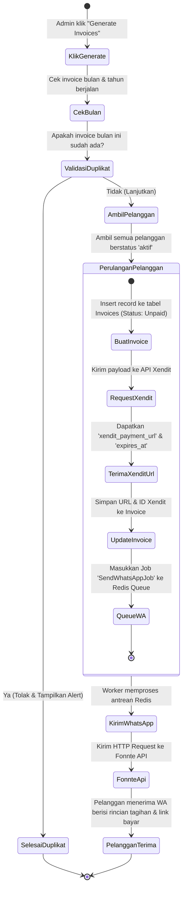
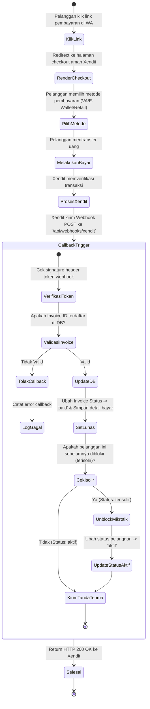
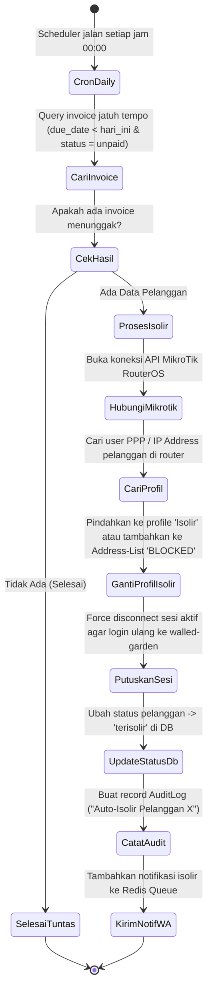
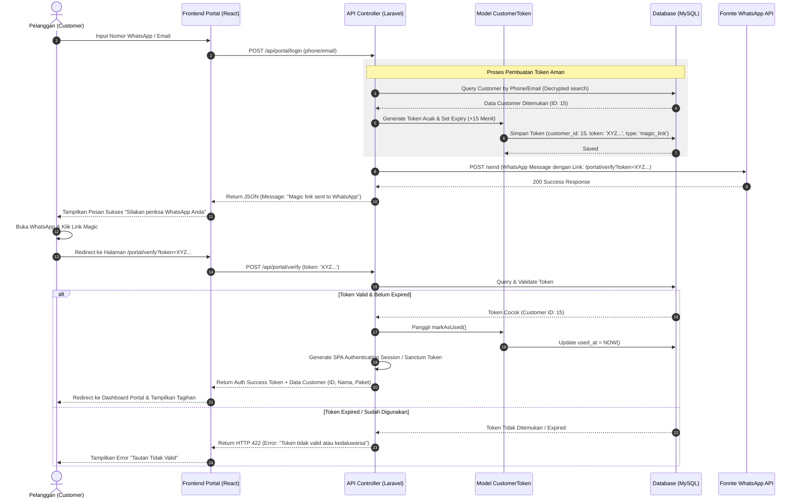
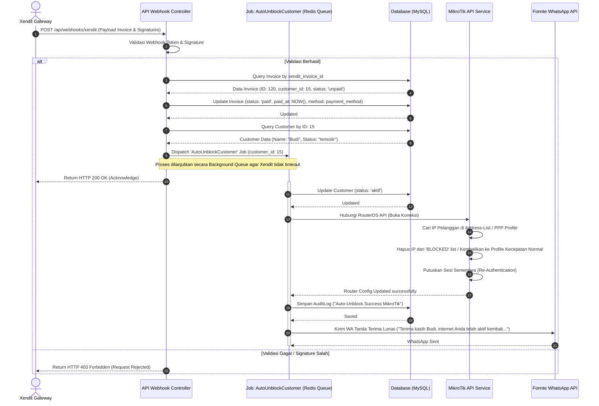
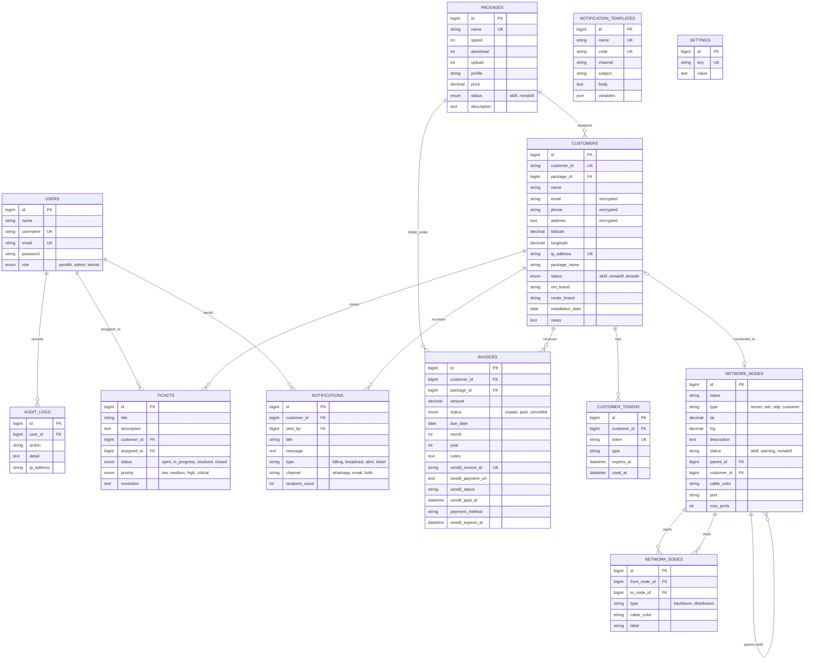

# Spesifikasi Lengkap Diagram Jaringan & Alur Kerja
## NetBilling ISP Management System (Monorepo)

Dokumen ini menyediakan spesifikasi teknis lengkap beserta kode **Mermaid.js** yang siap digunakan untuk menggambar diagram-diagram utama sistem manajemen ISP NetBilling. Sistem ini memadukan backend berbasis **Laravel 11** dan frontend **React (Vite + Tailwind)**, terintegrasi dengan **MikroTik RouterOS API**, **Xendit Payment Gateway**, **Fonnte/WhatsApp API**, dan database **RADIUS**.

---

## DAFTAR ISI
1. [Use Case Diagram](#1-use-case-diagram)
2. [Activity Diagram](#2-activity-diagram)
3. [Sequence Diagram](#3-sequence-diagram)
4. [Entity Relationship Diagram (ERD)](#4-entity-relationship-diagram-erd)
5. [Data Flow Diagram (DFD)](#5-data-flow-diagram-dfd)

---

## 1. Use Case Diagram

Diagram Use Case mendefinisikan fungsionalitas sistem dari sudut pandang para aktor (baik aktor manusia maupun sistem eksternal).

### Aktor Sistem:
1. **Pemilik (Owner)** (Aktor Manusia): Memiliki akses penuh ke seluruh sistem, laporan keuangan, dan audit logs.
2. **Admin (Administrator)** (Aktor Manusia): Mengelola data pelanggan, paket layanan, tagihan, verifikasi pembayaran manual, dan pengaturan sistem.
3. **Teknisi (Technician)** (Aktor Manusia): Mengelola topologi jaringan (ODP, ODC, Server), memantau NOC (Network Operations Center), dan mengelola support ticket.
4. **Pelanggan (ISP Customer)** (Aktor Manusia): Mengakses Customer Portal untuk melihat riwayat tagihan, meminta magic-link login, membuat support ticket, dan membayar tagihan.
5. **MikroTik Router** (Aktor Eksternal): Sistem perangkat keras yang menerima perintah isolir (suspensi) dan unblock (re-aktivasi) IP pelanggan, serta memberikan data NOC (CPU, uptime, log).
6. **Xendit Payment Gateway** (Aktor Eksternal): Sistem pembayaran otomatis yang membuat payment link dan mengirimkan callback/webhook ketika pembayaran lunas.
7. **Fonnte/WhatsApp API** (Aktor Eksternal): Pengirim notifikasi otomatis (billing reminder, link pembayaran, OTP magic link, dan tanda terima pembayaran).
8. **RADIUS Database** (Aktor Eksternal): Database otentikasi sesi aktif pengguna internet pelanggan ISP.

### Kode Mermaid Use Case Diagram:
```mermaid
usecaseDiagram
    %% Aktor Manusia
    actor Pemilik as "Pemilik (Owner)"
    actor Admin as "Admin (Billing)"
    actor Teknisi as "Teknisi"
    actor Pelanggan as "Pelanggan (Customer)"

    %% Aktor Eksternal
    actor Mikrotik as "MikroTik Router"
    actor Xendit as "Xendit API"
    actor WhatsApp as "WhatsApp API (Fonnte)"
    actor RADIUS as "RADIUS Server"

    %% Pewarisan Role
    Admin --> Pemilik : "Inherits permissions"
    Teknisi --> Pemilik : "Inherits permissions"

    rectangle "NetBilling ISP System" {
        usecase UC1 as "Login & Autentikasi (Sanctum)"
        usecase UC2 as "Manajemen Customer (CRUD)"
        usecase UC3 as "Manajemen Paket Layanan (CRUD)"
        usecase UC4 as "Pembuatan Invoice Bulanan (Batch)"
        usecase UC5 as "Generate Link Pembayaran Xendit"
        usecase UC6 as "Kirim Link Pembayaran via WA"
        usecase UC7 as "Webhook Handler (Notifikasi Lunas)"
        usecase UC8 as "Auto-Isolir (Blokir MikroTik)"
        usecase UC9 as "Auto-Unblock (Buka Blokir)"
        usecase UC10 as "Visualisasi Peta Topologi Jaringan"
        usecase UC11 as "Monitoring NOC & Traffic"
        usecase UC12 as "Request Magic Link Login Portal"
        usecase UC13 as "Akses Portal & Cek Tagihan"
        usecase UC14 as "Manajemen Support Ticket"
        usecase UC15 as "Lihat Audit Logs Keamanan"
        usecase UC16 as "Lihat Laporan Keuangan"
    }

    %% Hubungan Pemilik
    Pemilik --> UC15
    Pemilik --> UC16

    %% Hubungan Admin
    Admin --> UC1
    Admin --> UC2
    Admin --> UC3
    Admin --> UC4
    Admin --> UC5
    Admin --> UC6
    Admin --> UC7

    %% Hubungan Teknisi
    Teknisi --> UC1
    Teknisi --> UC10
    Teknisi --> UC11
    Teknisi --> UC14

    %% Hubungan Pelanggan
    Pelanggan --> UC12
    Pelanggan --> UC13
    Pelanggan --> UC14

    %% Hubungan ke Aktor Eksternal
    UC5 --> Xendit
    UC7 --> Xendit
    UC6 --> WhatsApp
    UC12 --> WhatsApp
    UC8 --> Mikrotik
    UC9 --> Mikrotik
    UC11 --> Mikrotik
    UC11 --> RADIUS

    %% Include & Extend
    UC4 .> UC5 : "<<include>>"
    UC7 .> UC9 : "<<include>>"
    UC8 .> UC6 : "<<extend>>"
```

---

## 2. Activity Diagram

Activity Diagram memvisualisasikan alur kerja dinamis dari sistem. Berikut adalah 3 alur kerja krusial dalam NetBilling:

### Alur 1: Proses Pembuatan Invoice Bulanan Massal (Batch Invoice Generation)
Menggambarkan bagaimana sistem secara otomatis membuat tagihan bulanan untuk seluruh pelanggan aktif dan membuat tautan pembayaran eksternal ke Xendit.



### Alur 2: Proses Pembayaran via Customer Portal & Gateway (Payment & Webhook Cycle)
Menggambarkan interaksi antara pelanggan, portal pelanggan, gerbang pembayaran Xendit, dan sinkronisasi status pembayaran pada sistem.



### Alur 3: Otomatisasi Isolir Pelanggan Tunggakan (Auto-Isolir Scheduler)
Menggambarkan bagaimana scheduler cron job harian memantau keterlambatan pembayaran dan mengisolasi jaringan pelanggan langsung ke router MikroTik.



---

## 3. Sequence Diagram

Sequence Diagram menunjukkan interaksi pesan berurutan antara objek runtime (Aktor, UI Frontend, Controller Backend, Model/DB, dan API Eksternal).

### Urutan 1: Autentikasi Magic-Link Tanpa Password (Customer Portal Login)
Pelanggan masuk ke portal secara instan tanpa perlu mengingat password, melainkan menggunakan tautan token sekali pakai yang dikirimkan langsung ke nomor WhatsApp mereka yang terdaftar.



### Urutan 2: Webhook Callback Xendit & Auto-Unblock MikroTik
Bagaimana sistem memproses pembayaran sukses secara real-time dari Xendit, memperbarui invoice, lalu secara asinkronus menghubungi router MikroTik untuk mengaktifkan kembali akses internet pelanggan.



---

## 4. Entity Relationship Diagram (ERD)

Database menggunakan relational engine **MySQL**. Keamanan tinggi diterapkan pada data pribadi pelanggan (`address`, `phone`, `email` disimpan dengan enkripsi reversibel di level database menggunakan Laravel Encryption).

### Entitas dan Skema Kolom:

1. **`users`** (Tabel Pengguna Administratif):
   - `id` (PK, BigInt, AutoIncrement)
   - `name` (VarChar, 255)
   - `username` (VarChar, 255, Unique)
   - `email` (VarChar, 255, Unique)
   - `password` (VarChar, 255)
   - `role` (Enum: `'pemilik'`, `'admin'`, `'teknisi'`)
   - `timestamps`

2. **`packages`** (Tabel Paket Layanan Internet):
   - `id` (PK, BigInt, AutoIncrement)
   - `name` (VarChar, 255, Unique)
   - `speed` (Int, Mbps)
   - `download` (Int, Limit kuota download jika FUP, Nullable)
   - `upload` (Int, Limit kuota upload, Nullable)
   - `profile` (VarChar, 255) - Nama profil di router MikroTik
   - `price` (Decimal, 12,2)
   - `status` (Enum: `'aktif'`, `'nonaktif'`)
   - `description` (Text, Nullable)
   - `timestamps`

3. **`customers`** (Tabel Pelanggan ISP):
   - `id` (PK, BigInt, AutoIncrement)
   - `customer_id` (VarChar, 255, Unique) - Nomor pelanggan (misal: NB-2026001)
   - `package_id` (FK, BigInt, References `packages.id`)
   - `name` (VarChar, 255)
   - `email` (VarChar, 255, Encrypted)
   - `phone` (VarChar, 255, Encrypted)
   - `address` (Text, Encrypted)
   - `latitude` (Decimal, 10,7, Nullable)
   - `longitude` (Decimal, 10,7, Nullable)
   - `ip_address` (VarChar, 45, Unique) - Alokasi IP pelanggan di router
   - `package_name` (VarChar, 255) - Redudansi nama paket untuk historis
   - `status` (Enum: `'aktif'`, `'nonaktif'`, `'terisolir'`)
   - `ont_brand` (VarChar, 50, Nullable)
   - `router_brand` (VarChar, 50, Nullable)
   - `installation_date` (Date)
   - `notes` (Text, Nullable)
   - `timestamps`

4. **`invoices`** (Tabel Tagihan Bulanan):
   - `id` (PK, BigInt, AutoIncrement)
   - `customer_id` (FK, BigInt, References `customers.id`, Indexed)
   - `package_id` (FK, BigInt, References `packages.id`)
   - `amount` (Decimal, 12,2)
   - `status` (Enum: `'unpaid'`, `'paid'`, `'cancelled'`, Indexed)
   - `due_date` (Date, Indexed)
   - `month` (Int, 1-12)
   - `year` (Int)
   - `notes` (Text, Nullable)
   - `xendit_invoice_id` (VarChar, 255, Nullable, Indexed)
   - `xendit_payment_url` (Text, Nullable)
   - `xendit_status` (VarChar, 50, Nullable)
   - `xendit_paid_at` (DateTime, Nullable)
   - `payment_method` (VarChar, 50, Nullable)
   - `xendit_expires_at` (DateTime, Nullable)
   - `timestamps`

5. **`customer_tokens`** (Tabel Token Otentikasi Magic-Link):
   - `id` (PK, BigInt, AutoIncrement)
   - `customer_id` (FK, BigInt, References `customers.id`, OnDelete Cascade)
   - `token` (VarChar, 64, Unique, Indexed)
   - `type` (VarChar, 20) - Default: `'magic_link'`
   - `expires_at` (DateTime)
   - `used_at` (DateTime, Nullable)
   - `timestamps`

6. **`network_nodes`** (Tabel Node Infrastruktur Jaringan di Peta):
   - `id` (PK, BigInt, AutoIncrement)
   - `name` (VarChar, 255)
   - `type` (VarChar, 20) - `'server'`, `'odc'`, `'odp'`, `'customer'`
   - `lat` (Decimal, 10,7)
   - `lng` (Decimal, 10,7)
   - `description` (Text, Nullable)
   - `status` (VarChar, 20) - `'aktif'`, `'warning'`, `'nonaktif'`
   - `parent_id` (FK, BigInt, References `network_nodes.id`, Self-Reference, Nullable)
   - `customer_id` (FK, BigInt, References `customers.id`, Nullable, OnDelete Set Null)
   - `cable_color` (VarChar, 20, Nullable)
   - `port` (VarChar, 20, Nullable)
   - `max_ports` (Int, Nullable) - Jumlah port maksimal ODP (misal: 8, 16)
   - `timestamps`

7. **`network_edges`** (Tabel Jalur Kabel Penghubung Node):
   - `id` (PK, BigInt, AutoIncrement)
   - `from_node_id` (FK, BigInt, References `network_nodes.id`, OnDelete Cascade)
   - `to_node_id` (FK, BigInt, References `network_nodes.id`, OnDelete Cascade)
   - `type` (VarChar, 50) - `'backbone'`, `'distribution'`
   - `cable_color` (VarChar, 20)
   - `label` (VarChar, 255, Nullable)
   - `timestamps`

8. **`tickets`** (Tabel Support & Gangguan Jaringan):
   - `id` (PK, BigInt, AutoIncrement)
   - `title` (VarChar, 255)
   - `description` (Text)
   - `customer_id` (FK, BigInt, References `customers.id`, OnDelete Cascade)
   - `assigned_to` (FK, BigInt, References `users.id`, Nullable)
   - `status` (Enum: `'open'`, `'in_progress'`, `'resolved'`, `'closed'`)
   - `priority` (Enum: `'low'`, `'medium'`, `'high'`, `'critical'`)
   - `resolution` (Text, Nullable)
   - `timestamps`

9. **`notifications`** (Tabel Riwayat Notifikasi Keluar):
   - `id` (PK, BigInt, AutoIncrement)
   - `customer_id` (FK, BigInt, References `customers.id`, Nullable)
   - `sent_by` (FK, BigInt, References `users.id`, Nullable)
   - `title` (VarChar, 255)
   - `message` (Text)
   - `type` (VarChar, 50) - `'billing'`, `'broadcast'`, `'alert'`, `'ticket'`
   - `channel` (VarChar, 20) - `'whatsapp'`, `'email'`, `'both'`
   - `recipient_count` (Int, Default: 1)
   - `timestamps`

10. **`notification_templates`** (Tabel Templat Notifikasi):
    - `id` (PK, BigInt, AutoIncrement)
    - `name` (VarChar, 255, Unique)
    - `code` (VarChar, 100, Unique)
    - `channel` (VarChar, 20)
    - `subject` (VarChar, 255, Nullable)
    - `body` (Text)
    - `variables` (JSON)
    - `timestamps`

11. **`settings`** (Tabel Pengaturan Global Dinamis):
    - `id` (PK, BigInt, AutoIncrement)
    - `key` (VarChar, 255, Unique)
    - `value` (Text, Nullable)
    - `timestamps`

12. **`audit_logs`** (Tabel Log Aktivitas Administrator):
    - `id` (PK, BigInt, AutoIncrement)
    - `user_id` (FK, BigInt, References `users.id`, OnDelete Set Null, Nullable)
    - `action` (VarChar, 255)
    - `detail` (Text, Nullable)
    - `ip_address` (VarChar, 45)
    - `timestamps`

### Kode Mermaid ERD:


---

## 5. Data Flow Diagram (DFD)

Data Flow Diagram menggambarkan pergerakan data dari entitas eksternal ke dalam sistem, bagaimana data diolah dalam proses, dan disimpan dalam data store.

### DFD Level 0: Context Diagram
Menunjukkan interaksi batas sistem (system boundary) antara NetBilling ISP dengan 6 entitas eksternal.

```mermaid
flowchart TD
    %% Entitas Eksternal
    A([Admin / Owner / Teknisi])
    C([ISP Customers])
    M([MikroTik Router])
    X([Xendit Payment Gateway])
    W([WhatsApp / Fonnte API])
    R([RADIUS Database])

    %% Sistem Utama
    S[System Boundary: NetBilling ISP Management]

    %% Aliran Data Admin
    A -->|1. Data Admin & Kredensial| S
    A -->|2. Data Customer & Paket| S
    A -->|3. Perintah Generate Invoice bulanan| S
    A -->|4. Input Node & Edge Jaringan| S
    A -->|5. Balas Tiket Gangguan| S
    S -->|1. Log Aktivitas & Alert NOC| A
    S -->|2. Detail Tagihan & Peta Jaringan| A
    S -->|3. Laporan Keuangan Ke Pemilik| A

    %% Aliran Data Customer
    C -->|1. Request Login Link via WA| S
    C -->|2. Verifikasi Kredensial Token| S
    C -->|3. Membuat Support Ticket baru| S
    S -->|1. Link Portal & Invoice PDF| C
    S -->|2. Informasi Kecepatan & Status Layanan| C

    %% Aliran Data Router MikroTik
    M -->|1. Log Router & Beban CPU| S
    M -->|2. Live Traffic & Status Uptime| S
    S -->|1. Perintah Isolir IP / Profile Suspended| S
    S -->|2. Perintah Reactivate IP / Profile Aktif| M

    %% Aliran Data Xendit
    S -->|1. Request Tautan Invoice & Nominal| X
    X -->|2. Kirim Callback Status Lunas (Webhook)| S

    %% Aliran Data WhatsApp
    S -->|1. Kirim Pesan & OTP Token / Link| W
    W -->|2. Status Delivery Report| S

    %% Aliran Data RADIUS
    R -->|1. Data Sesi Aktif Pelanggan| S
    S -->|2. Sinkronisasi Data Akun Pengguna| R

    style S fill:#1D4ED8,stroke:#1E40AF,stroke-width:2px,color:#fff
```

### DFD Level 1: Diagram Proses Rinci
Mendekomposisi sistem menjadi 15 proses utama, aliran data internal, dan 6 database penyimpanan (data store).

```mermaid
flowchart TD
    %% Entitas Eksternal
    A([Admin/Owner/Teknisi])
    C([ISP Customers])
    M([MikroTik Router])
    X([Xendit Payment Gateway])
    W([WhatsApp/Fonnte API])
    R([RADIUS Database])

    %% Proses-Proses
    subgraph Proses "Proses Utama Sistem"
        P1[1. Authentication]
        P2[2. Customer Mgmt]
        P3[3. Invoice Generation]
        P4[4. Xendit Payment Link]
        P5[5. Send Payment Link]
        P6[6. Xendit Webhook Handler]
        P7[7. Notification Engine]
        P8[8. Background Queue Worker]
        P9[9. Network Topology Mgmt]
        P10[10. NOC Monitoring]
        P11[11. Auto-Isolir Task]
        P12[12. Portal Authentication]
        P13[13. Portal Access]
        P14[14. RADIUS Integration]
        P15[15. Audit Logger]
    end

    %% Data Stores (Penyimpanan)
    subgraph Stores "Data Stores (MySQL & Redis)"
        D1[(1. Users DB)]
        D2[(2. Customers DB)]
        D3[(3. Invoices DB)]
        D4[(4. Network DB)]
        D5[(5. Audit DB)]
        D6[(6. Redis Cache & Queue)]
    end

    %% Aliran Proses 1 & 15: Otentikasi & Audit
    A -->|Username & Password| P1
    P1 -->|Baca Data| D1
    P1 -->|Menghasilkan Token| A
    P1 -->|Log Aktivitas| P15
    P15 -->|Tulis Log| D5

    %% Aliran Proses 2: Customer Management
    A -->|Data Pelanggan Baru/Ubah| P2
    P2 -->|CRUD Operations| D2
    P2 -->|Log Aktivitas| P15

    %% Aliran Proses 3, 4, 5: Siklus Penagihan Bulanan
    A -->|Trigger Generate Invoices| P3
    P3 -->|Ambil Data Aktif| D2
    P3 -->|Simpan Unpaid Invoices| D3
    P3 -->|Request Payment Link| P4
    P4 -->|Payload Tagihan| X
    X -->|Dapatkan Link Xendit| P4
    P4 -->|Simpan URL & ID Xendit| D3
    P4 -->|Log| P15
    P3 -->|Trigger Notifikasi WA| P5
    P5 -->|Buat Job Notifikasi| D6
    D6 -->|Ambil Job| P8
    P8 -->|Kirim WA Tagihan| W

    %% Aliran Proses 6: Callback Xendit Webhook
    X -->|Webhook Notifikasi Lunas| P6
    P6 -->|Update Status Invoice -> Paid| D3
    P6 -->|Trigger Auto-Unblock| D6
    P6 -->|Catat Transaksi| P15

    %% Aliran Proses 11: Auto-Isolir (Daily Scheduler)
    D6 -->|Trigger Scheduler harian| P11
    P11 -->|Cari Pelanggan Menunggak| D3
    P11 -->|Update Status -> Terisolir| D2
    P11 -->|API: Blokir IP Pelanggan| M
    P11 -->|Catat Tindakan| P15

    %% Aliran Proses 9 & 10: Topologi Jaringan & NOC
    A -->|Data Lat/Lng Node & Kabel| P9
    P9 -->|Simpan Topologi| D4
    P9 -->|Catat Perubahan| P15
    A -->|Request NOC Stats| P10
    P10 -->|API: Query Traffic & CPU| M
    P10 -->|Kirim Statistik Live| A

    %% Aliran Proses 12 & 13: Portal Pelanggan
    C -->|Input No WA/OTP| P12
    P12 -->|Validasi Kredensial| D2
    P12 -->|Kirim OTP Link| W
    C -->|Buka Link Portal| P13
    P13 -->|Tampilkan Detail & Tagihan| D3

    %% Aliran Proses 14: RADIUS Integration
    P14 -->|API: Query Active Sessions| R
    P14 -->|Tampilkan Sesi Aktif| A
```

---
*Dokumen spesifikasi ini mencerminkan struktur database ril dan alur logika sistem NetBilling ISP.*
